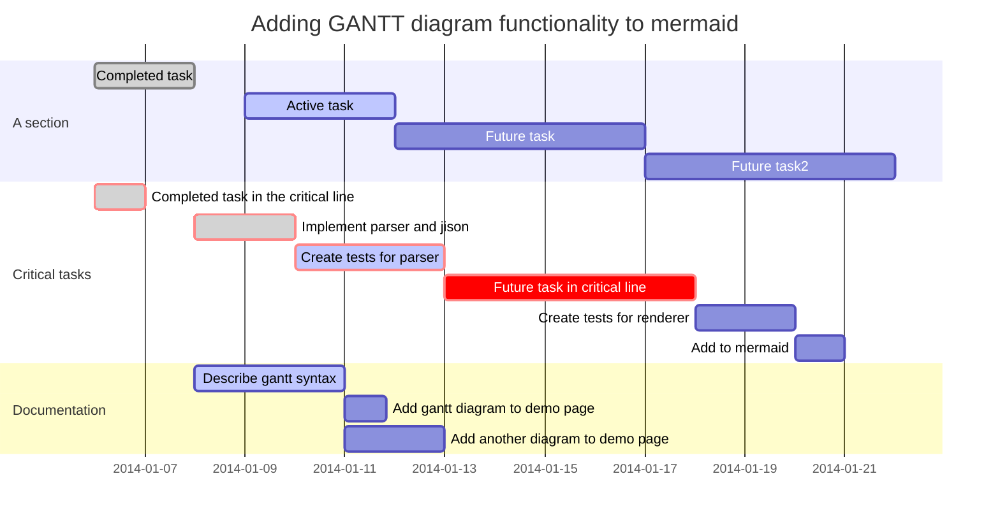
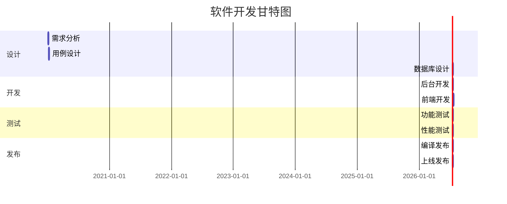

Marmaid支持使用gantt图表语法绘制甘特图。下面是marmaid gantt图的详细语法和示例:
### 语法
| 语法 | 描述 | 示例 |
| :-: | :-: | :-: |
| dateFormat | 设置日期格式 | dateFormat YYYY-MM-DD |
| title | gantt图标题 | title 项目进度 |
| section | 任务分组 | section 阶段一 section 阶段二|
| :active, :done, :crit, | 任务状态 |:active, des1,开始日期, 持续时间 :done, des2,开始日期, 持续时间  |
| after | 任务依赖关系 | des3, after des2,持续时间|
### 示例
