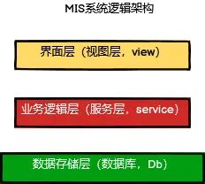
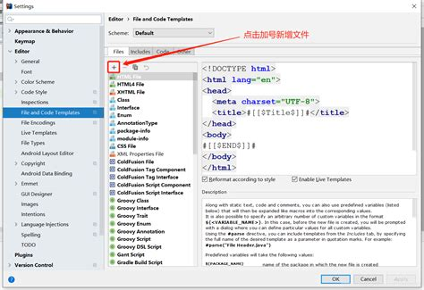

# 自动化测试平台设计


# 功能列表

## 工具平台
测试用例组织，测试报告的收集与展示


### 数据驱动用例管理
- excel用例导入
- 页面直接用例编写
- 现有用例编辑

### 服务信息管理
- 不同sim环境的服务访问地址管理 
- 不同sim环境的服务MySQL数据库管理 --done
- 不同sim环境的服务Redis缓存管理 --done

### 转发平台存活性管理
- 接收转发平台心跳信息，维护转发平台存活列表
- 根据测试所需sim环境提供转发平台地址信息


### 用例组织
- 扫描用例编写平台中的用例，可以组合成不同的用例集
- 组织数据驱动的用例成不同的用例集


### 用例批量触发
- 批量触发用例集
- 定时触发用例集，生成报告并发送给相关人


## 用例编写平台
接口封装与用例组织，测试报告生成
### 基础框架
- 提供与转发平台交互的接口
- 从工具平台获取必要的测试数据
- 接收工具平台的测试执行请求，拼装测试集
- 组织测试数据，发送给转发平台
- 获取转发平台返回的数据，生成报告


### 接口封装
由业务QA编写测试服务的接口封装，便于case编写人员快速编写测试case
- passport登录能力
- upm登录能力
- 


### mock管理
待定
### 用例编写
由业务QA编写单条测试case，每条case可以是单次调用与检查也可以是一整条测试通路，但单条测试case需要闭环，完成全部要的数据构造与清理过程


## 转发平台
将用例转化为具体请求，发送给相应的测试服务器
### HTTP接口转发能力
已实现
### 数据库请求转发能力
已实现
### Redis请求转发能力
已部分实现
### DiRPC（Thrift）求转发能力
待实现


# 测试工具开发计划
## 9月
- 完成数据驱动脚本编写方式开发
- 完成测试报告生成能力
- 


设计一个Spring Boot后台服务的系统架构图可以使用UML类图或者组件图来表示。这些图可以帮助你更好地理解系统的组成部分和它们之间的关系。

以下是一个简单的示例图，展示了一个典型的Spring Boot后台服务的系统架构：

```plaintext
@startuml

package "Spring Boot Application" {
  [Controller]
  [Service]
  [Repository]
  [Database]
}

package "External Systems" {
  [External API]
  [Message Queue]
}

[Controller] --> [Service]
[Service] --> [Repository]
[Repository] --> [Database]
[Service] --> [External API]
[Service] --> [Message Queue]

@enduml
```

这个示例图展示了一个典型的三层架构，包括控制器（Controller）、服务（Service）、数据访问层（Repository）和数据库（Database）。此外，还展示了与外部系统（如外部API和消息队列）的交互。

请注意，这只是一个简单的示例图，你可以根据你的具体需求和系统架构进行调整和扩展。你可以使用工具如PlantUML来生成和编辑这样的图表。


在设计Springboot后台服务的系统架构图时，你可以参考以下的五层架构³：
- **视图层（View）**：负责数据展示，即用户界面。
- **控制层（Controller）**：负责处理用户请求，调用相应的服务。
- **服务层（Service）**：负责业务逻辑处理，如数据校验、计算等。
- **持久层（Persistence，也称为DAO或Mapper层）**：负责数据持久化，如数据库交互。
- **数据库层（DB）**：存储数据的地方。

此外，还有一个**实体层（Entity，也称为POJO或Model层）**，它代表了业务数据²³。

这是一个典型的Spring Boot项目的分层结构，但具体的架构可能会根据项目的实际需求进行调整。例如，你可能需要添加一个安全层来处理身份验证和授权，或者添加一个缓存层来提高系统性能。

至于系统架构图的绘制，你可以使用各种绘图工具，如Visio、Draw.io、Lucidchart等。这些工具都提供了丰富的图形和模板，可以帮助你更直观地表示系统的各个组件及其之间的关系。

对于示例图，我很抱歉，由于我目前的功能限制，我无法提供具体的示例图。但你可以在网上搜索"Spring Boot系统架构图"，你会找到许多相关的示例，这些示例可以作为你创建自己的系统架构图的参考。希望这些信息对你有所帮助！





源: 与必应的对话， 2023/11/24
(1) springboot 项目架构（分层结构） - 远洪 - 博客园. https://www.cnblogs.com/liyuanhong/articles/16910061.html.
(2) Spring boot 三层框架dao层、service层、controller层+实体model .... https://blog.csdn.net/fztsilly/article/details/113888863.
(3) 优雅地组织 Spring 项目结构，附 Java 微服务架构示例图 .... https://juejin.cn/post/7041767631992389645.
(4) 分布式、微服务架构Spring Boot入门及实例介绍 - 知乎. https://zhuanlan.zhihu.com/p/72204579.
(5) undefined. http://mybatis.org/dtd/mybatis-3-mapper.dtd.

